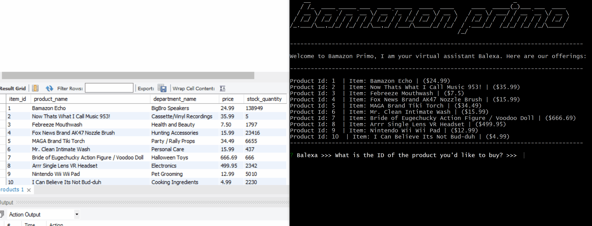
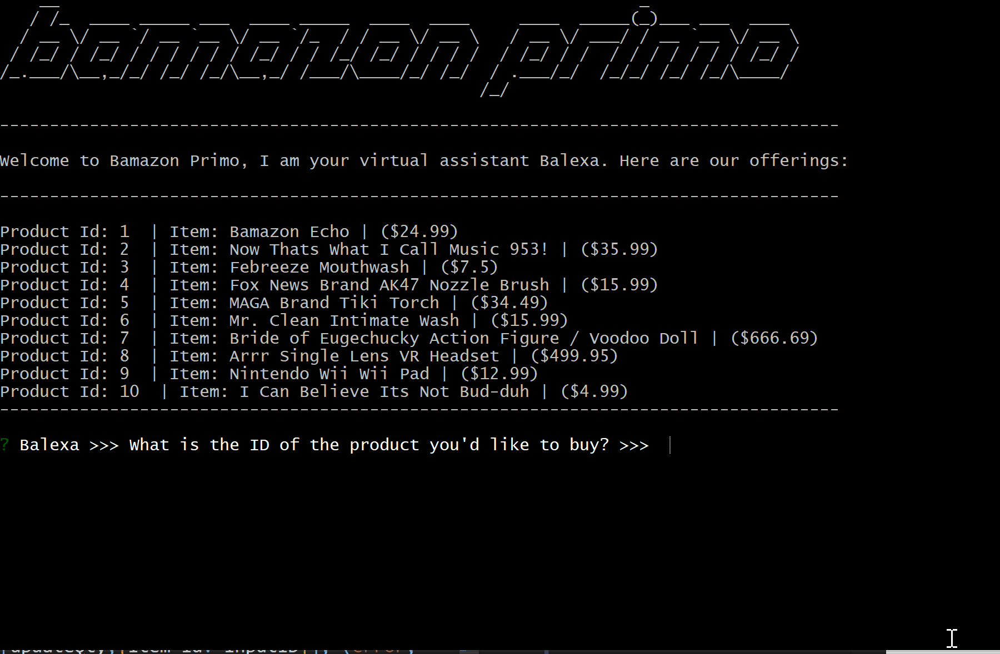

# BamazonPrimo™ - A CLI Storefront for Curious Items
```

 _                                                       _                 
| |                                                     (_)                
| |__   __ _ _ __ ___   __ _ _______  _ __    _ __  _ __ _ _ __ ___   ___  
| '_ \ / _` | '_ ` _ \ / _` |_  / _ \| '_ \  | '_ \| '__| | '_ ` _ \ / _ \ 
| |_) | (_| | | | | | | (_| |/ / (_) | | | | | |_) | |  | | | | | | | (_) |
|_.__/ \__,_|_| |_| |_|\__,_/___\___/|_| |_| | .__/|_|  |_|_| |_| |_|\___/ 
                                             | |                           
                                             |_|  
<<< BamazonPrimo™, Balexa© and Bbezos© are powered by: jetsetEngine19™ >>>
```


- How to run customer facing app in Bash/Terminal:

```
node bamazonCustomer
```

- Customer Experience: 
Balexa will introduce itself and inquire for your input. Your order total will be presented after your input, and Bbezos the GreedBot will thank you for your business...


- A MySQL database called `bamazon` has been previously created and populated with the products shown above, along with inventory numbers. 

- The application checks if the `bamazon database inventory` has enough units to fulfill the customer's order request. In the example below, the database has enough inventory and the order was fulfilled which means the SQL database will be updated to reflect the new quantity: 




- In the next demo below, there will not be enough inventory to fulfill the customer's order, so the following error message will appear:

